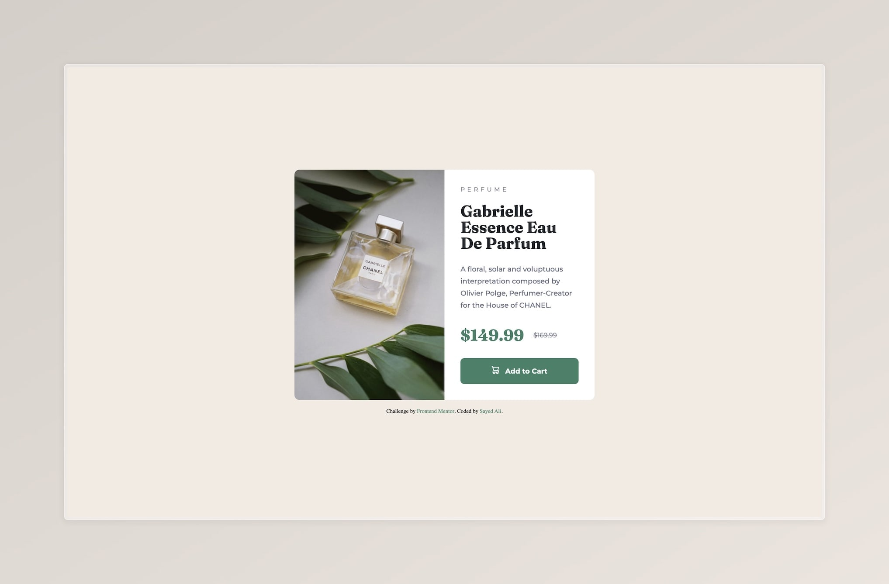

# Frontend Mentor - Product preview card component solution

This is a solution to the [Product preview card component challenge on Frontend Mentor](https://www.frontendmentor.io/challenges/product-preview-card-component-GO7UmttRfa). Frontend Mentor challenges help you improve your coding skills by building realistic projects.

- Solution on [GitHub](https://github.com/sydalwedaie/fm-product-preview-card-component)
- Live Site on [Netlify](https://product-preview-card-component-GO7Um.netlify.app)

# Built with

- Semantic HTML5 markup
- CSS custom properties
- Flexbox
- Mobile-first workflow

### What I learned

- Use the`<picture>` element to create responsive images. It allowed me to dynamically load the correct image based on the viewport size.
- Use CSS Local fonts 
- Use `element::before` selector and the `content: url()` property to set the shopping cart icon. Bonus: It automatically sets the image to the appropriate size!
- `object-fit` property needs a set width and height on the element. I had a situation where the image container was shorter than the adjacent info container. I solved it by setting the height to 100% with `object-fit: cover`. The width was already set at 100%.
